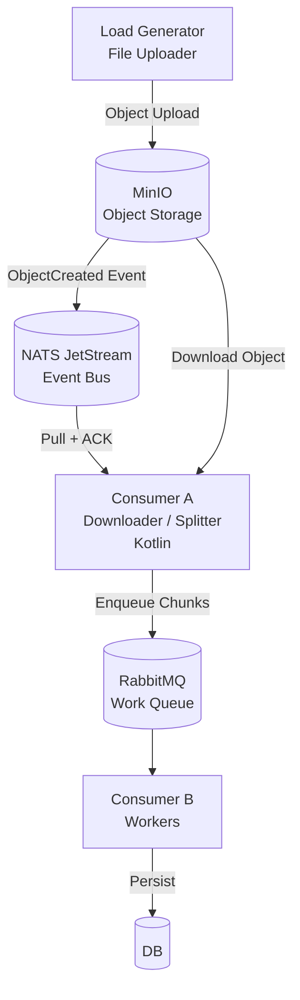

```mermaid
flowchart TB
    %% =====================
    %% External Load
    %% =====================
    LG[Load Generator<br/>File Uploader]

    %% =====================
    %% Object Storage
    %% =====================
    MINIO[(MinIO<br/>Object Storage)]

    %% =====================
    %% Event Bus
    %% =====================
    NATS[(NATS JetStream<br/>Event Bus)]

    %% =====================
    %% Consumer
    %% =====================
    CA[Consumer A<br/>Downloader / Splitter<br/>Kotlin]

    %% =====================
    %% Message Queue
    %% =====================
    RMQ[(RabbitMQ<br/>Work Queue)]

    %% =====================
    %% Downstream Consumers
    %% =====================
    CB[Consumer B<br/>Workers]

    %% =====================
    %% Downstream Consumers
    %% =====================
    DB[(DB)]

    %% =====================
    %% Data Flow
    %% =====================
    LG -->|Object Upload| MINIO
    MINIO -->|ObjectCreated Event| NATS
    NATS -->|Pull + ACK| CA
    MINIO -->|Download Object| CA
    CA -->|Enqueue Chunks| RMQ
    RMQ --> CB
    CB -->|Persist| DB

```